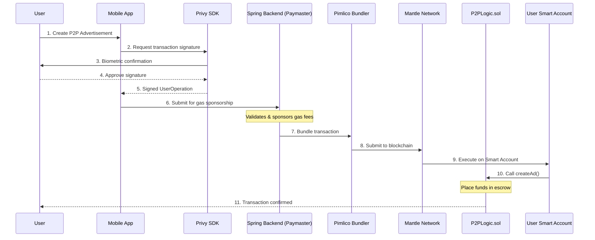
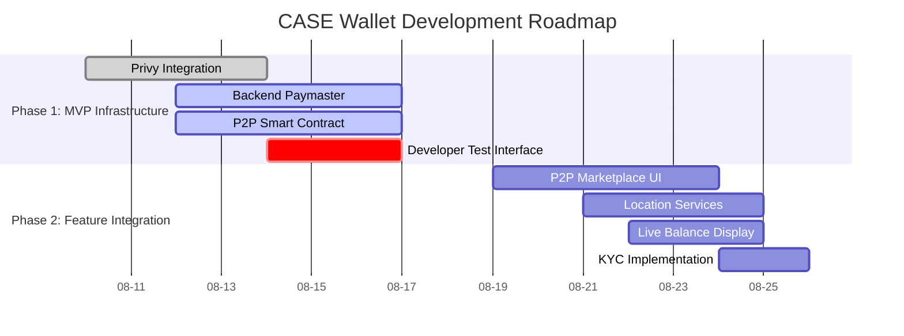

# CASE - Digital Wallet

A complete mobile digital wallet application built with Flutter, featuring advanced cryptocurrency capabilities, Web3 integration, and comprehensive P2P exchange functionality for Latin American markets.

## 🚀 Overview

CASE is a next-generation digital wallet that bridges traditional finance and Web3 technologies. Built with Flutter and powered by smart contracts on Mantle Network, it offers gasless transactions, P2P exchanges, and seamless cryptocurrency management with a focus on user experience and mainstream adoption.

### Key Highlights

- **Gas-sponsored transactions** through Account Abstraction (ERC-4337)
- **Seamless Web3 onboarding** with Privy SDK integration
- **P2P cryptocurrency exchange** with on-chain escrow
- **Location-based services** for crypto-accepting businesses
- **Multi-currency support** with real-time market data
- **Latin American market focus** with regional payment methods

## ✨ Core Features

### 🔐 Authentication System

- **Social Login Integration**: Email, Google OAuth, phone number
- **Web3 Wallet Connections**: MetaMask, WalletConnect, Coinbase Wallet
- **Smart Account Creation**: Automatic embedded wallet generation
- **Biometric Security**: Fingerprint and face recognition support

### 💰 Digital Wallet

- **Multi-currency Balance**: BTC, ETH, USDT, BNB, SOL support
- **Cross-chain Transactions**: Automated routing across networks
- **Smart Contract Integration**: Direct DeFi protocol interactions
- **Portfolio Analytics**: Profit/loss tracking and market insights
- **USDT Safeguarding**: Protection against market volatility

### 🤝 P2P Exchange

- **On-chain Escrow**: Smart contract-secured transactions
- **Real-time Matching**: Automated offer matching system
- **Multiple Payment Methods**: Bank transfers, mobile money, cash
- **Agent Network**: Verified P2P exchange agents with KYC
- **Competitive Rates**: Market-driven pricing mechanisms

### 🗺️ Location Services

- **Business Mapping**: Crypto-accepting merchants and services
- **P2P ATM Network**: Real-time availability and competitive rates
- **Route Optimization**: Navigation to nearest service providers
- **Advanced Filtering**: By distance, rating, service type, hours
- **Offline Support**: Cached maps for low-connectivity areas

### 📊 Market Data

- **Real-time Prices**: Live cryptocurrency market feeds
- **Interactive Charts**: Technical analysis tools and indicators
- **Price Alerts**: Customizable market notifications
- **Trading History**: Comprehensive transaction records
- **Market Analytics**: Trend analysis and portfolio insights

## 🏗️ Technical Architecture

### System Overview

Our architecture combines modern mobile development with cutting-edge Web3 infrastructure to deliver a seamless user experience while maintaining full decentralization and security.

### Core Architecture Flow

The following diagram illustrates how a user creates a P2P advertisement with platform-sponsored gas fees:



### Technology Stack

#### Frontend (Flutter)

- **Framework**: Flutter 3.x with Dart
- **State Management**: BLoC pattern with Provider
- **Navigation**: GoRouter for declarative routing
- **UI Components**: Material Design 3
- **Maps Integration**: Google Maps SDK
- **Authentication**: Privy SDK for Web3 auth

#### Backend Infrastructure

- **API Server**: Spring Boot with RESTful architecture
- **Database**: PostgreSQL for user data and transaction history
- **Paymaster Service**: Gas fee sponsorship and validation
- **KYC Integration**: Identity verification and compliance
- **Payment Gateway**: Integration with local payment methods

#### Blockchain Layer

- **Network**: Mantle L2 for reduced costs and faster transactions
- **Smart Contracts**: Solidity contracts for P2P escrow and logic
- **Account Abstraction**: ERC-4337 for gasless user experience
- **Bundler**: Pimlico for efficient transaction batching
- **Wallet Infrastructure**: Privy for embedded wallet management

## 🛣️ Development Roadmap

Our development follows a strategic two-phase approach designed for the Cookathon competition:

### Phase 1: MVP Foundation (Round 2)

**Focus: Core Web3 Infrastructure**



#### Key Deliverables

- ✅ **Privy Authentication**: Complete social login and wallet connection flows
- ✅ **Paymaster Backend**: Gas sponsorship infrastructure with Pimlico
- ✅ **P2P Smart Contract**: On-chain escrow logic (`P2PLogic.sol`)
- ✅ **Developer Interface**: React testing dashboard for smart contracts

### Phase 2: Feature Integration (Round 3)

**Focus: User Experience and Market Features**

#### Planned Features

- 🔄 **Full P2P Integration**: Connect UI to deployed smart contracts
- 🔄 **Dynamic Balance Display**: Real-time on-chain balance reading
- 🔄 **Location Service Connection**: Link Smart Accounts to map features
- 🔄 **Complete KYC Flow**: Full identity verification for agents and merchants

### Strategic Advantages

#### Technical Innovation

- **Account Abstraction**: First-class ERC-4337 implementation
- **Gas Sponsorship**: Platform-sponsored transactions for better UX
- **Cross-chain Support**: Multi-network cryptocurrency operations
- **Smart Contract Security**: Auditable on-chain P2P logic

#### Market Differentiation

- **User-First Design**: Prioritizes mainstream adoption over technical complexity
- **Regional Focus**: Tailored for Latin American market needs
- **Complete Ecosystem**: Combines wallet, exchange, commerce, and maps
- **Compliance Ready**: Built-in KYC and regulatory compliance features

## 📱 Project Structure

```
lib/
├── core/
│   ├── config/              # App configurations and constants
│   ├── di/                  # Dependency injection with GetIt
│   ├── network/             # HTTP client and API configurations
│   ├── router/              # GoRouter setup and route definitions
│   └── theme/               # Material Design 3 theming
├── features/
│   ├── auth/                # Privy authentication and Web3 onboarding
│   │   ├── data/            # Auth repositories and data sources
│   │   ├── domain/          # Business logic and use cases
│   │   └── presentation/    # UI pages, BLoCs, and widgets
│   ├── wallet/              # Core wallet functionality
│   │   ├── data/            # Blockchain integration and repositories
│   │   ├── domain/          # Transaction entities and business rules
│   │   └── presentation/    # Wallet UI and transaction pages
│   ├── p2p/                 # Peer-to-peer exchange management
│   ├── maps/                # Location services and business mapping
│   ├── crypto/              # Cryptocurrency trading and markets
│   ├── profile/             # User management and settings
│   ├── activities/          # Transaction history and tracking
│   └── commerce/            # Merchant and business integrations
└── main.dart                # Application entry point
```

## 🔧 Setup and Configuration

### Prerequisites

- Flutter 3.x or higher
- Dart SDK 3.x or higher
- Android Studio / VS Code with Flutter plugins
- Git for version control

### API Configuration

#### Google Maps Setup

1. Visit [Google Cloud Console](https://console.cloud.google.com/)
2. Enable Maps SDK, Places API, and Geocoding API
3. Create an API key and add to `android/app/src/main/AndroidManifest.xml`:

```xml
<meta-data
    android:name="com.google.android.geo.API_KEY"
    android:value="YOUR_GOOGLE_MAPS_API_KEY" />
```

#### CoinGecko API (Market Data)

1. Register at [CoinGecko API](https://www.coingecko.com/en/api)
2. Configure API key in `lib/core/config/app_config.dart`
3. Update base URL in crypto data sources

### Installation

1. Clone the repository:

```bash
git clone https://github.com/moises-cisneros/Case-Billetera-Digital.git
cd Case-Billetera-Digital
```

2. Install dependencies:

```bash
flutter pub get
```

3. Configure API keys and run:

```bash
flutter run
```

## 🧪 Testing and Quality

### Testing Strategy

- **Unit Tests**: BLoC logic and use case validation
- **Widget Tests**: UI component behavior and interactions
- **Integration Tests**: End-to-end user flow validation
- **Mock Services**: Simulated external API responses

### Code Quality Standards

- **Linting**: Strict Dart analysis rules
- **Formatting**: Consistent code style with dartfmt
- **Architecture**: Clean Architecture with SOLID principles
- **Documentation**: Comprehensive inline documentation

## 🚀 Recent Updates

### Version 2.0.0 - Authentication Overhaul (August 2025)

#### Major Features Added

- ✅ **Unified Authentication System**: Complete Privy SDK simulation
- ✅ **Enhanced Profile Management**: Full user profile with security settings
- ✅ **Improved Navigation**: Streamlined GoRouter configuration
- ✅ **BLoC Architecture Refinement**: Proper dependency injection setup

#### Critical Bug Fixes

- ✅ Fixed ProfileBloc provider registration issues
- ✅ Resolved authentication navigation errors
- ✅ Corrected maps BLoC integration problems
- ✅ Enhanced error handling throughout the application
- ✅ Optimized app performance and reduced memory footprint

### Development Guidelines

- Use BLoC pattern for state management
- Follow Clean Architecture principles
- Write unit tests for business logic
- Maintain consistent code formatting
- Document complex algorithms and business rules

## 🙏 Acknowledgments

### Technology Partners

- **[Flutter Team](https://flutter.dev/)** - Cross-platform mobile framework
- **[BLoC Library](https://bloclibrary.dev/)** - Predictable state management
- **[Privy](https://privy.io/)** - Web3 authentication infrastructure
- **[CoinGecko](https://www.coingecko.com/)** - Cryptocurrency market data
- **[Google Maps Platform](https://developers.google.com/maps)** - Location services

### Special Thanks

- **Mantle Network** - L2 blockchain infrastructure
- **Pimlico** - Account abstraction bundler services
- **Flutter Community** - Extensive package ecosystem
- **Open Source Contributors** - Essential tools and libraries

## 📞 Support

For technical support and inquiries:

- **Repository**: [CASE Digital Wallet](https://github.com/moises-cisneros/Case-Billetera-Digital)
- **Issues**: Use GitHub Issues for bug reports and feature requests
- **Documentation**: Check `/docs` folder for additional technical details

---

**Version**: 2.0.0 | **Last Updated**: August 15, 2025
